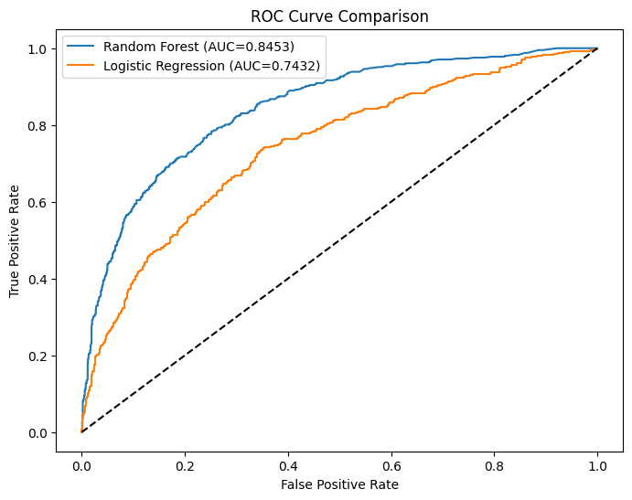

# bank-churn-prediction
# Customer Churn Prediction with Machine Learning

This project focuses on predicting customer churn using machine learning models such as **Random Forest** and **Logistic Regression**. The dataset used is a bank customer dataset that includes demographic, account, and behavioral features.

---

## 📊 Dataset

The dataset is taken from the `Churn_Modelling.csv` file and contains 10,000 bank customers.  
It includes the following relevant features:

- CreditScore, Age, Tenure, Balance, NumOfProducts, HasCrCard, IsActiveMember, EstimatedSalary
- Gender (encoded)
- Geography (One-hot encoded)

Target Variable:
- `Exited` → 1: Customer churned, 0: Customer retained

---

## 🔧 Preprocessing Steps

- Dropped irrelevant columns: RowNumber, CustomerId, Surname
- Gender column encoded as 0 (Female) and 1 (Male)
- One-hot encoding applied to the Geography column
- SMOTE technique applied to balance the dataset

---

## 🧠 Models Used

1. **Random Forest Classifier**
   - Default and tuned versions (via GridSearchCV)
   - Best Parameters:  
     `{ 'n_estimators': 200, 'max_depth': 20, 'min_samples_split': 2, 'min_samples_leaf': 1 }`

2. **Logistic Regression**
   - Used as a baseline for comparison
   - `max_iter=1000` set to ensure convergence

---

## 📈 Model Evaluation (Test Set)

| Metric          | Random Forest | Logistic Regression |
|-----------------|----------------|----------------------|
| Accuracy        | 0.82           | 0.74                 |
| Precision (1)   | 0.56           | Lower                |
| Recall (1)      | 0.63           | Lower                |
| F1-Score (1)    | 0.59           | Lower                |
| ROC AUC Score   | **0.8453**     | 0.7431               |

---

## 📉 ROC Curve Comparison

The ROC curve shows that **Random Forest** outperforms **Logistic Regression**, especially in identifying churned customers. The curve is closer to the top-left corner, indicating better true positive and lower false positive rates.

 *(Add your ROC image if exported)*

---

## 🚀 Conclusion

- **Random Forest** performed significantly better than Logistic Regression in identifying customer churn.
- SMOTE was effective in handling class imbalance.
- Hyperparameter tuning improved model performance.

---

## 🛠️ Tech Stack

- Python
- Scikit-learn
- Imbalanced-learn
- Matplotlib
- Google Colab

---

## 📁 Folder Structure

Churn_Prediction_Project/
│
├── Churn_Modelling.csv
├── churn_prediction.ipynb
├── README.md
└── roc_curve.png (optional if exporting)

Model Evaluation Summary 
Two machine learning models were trained to predict customer churn: Logistic Regression and Random Forest.
After applying SMOTE to handle class imbalance, the models were evaluated on a 20% test set.

The Random Forest model achieved an accuracy of 82% and an ROC AUC of 0.845, clearly outperforming Logistic Regression (ROC AUC: 0.743).

It also showed stronger recall and precision for predicting the minority class (churned customers).

Hyperparameter tuning with GridSearchCV helped optimize the model.

📌 This suggests that Random Forest is a more robust choice for churn prediction in this context.
